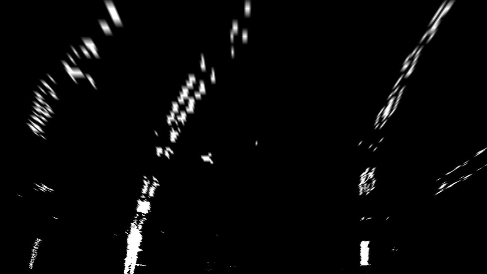
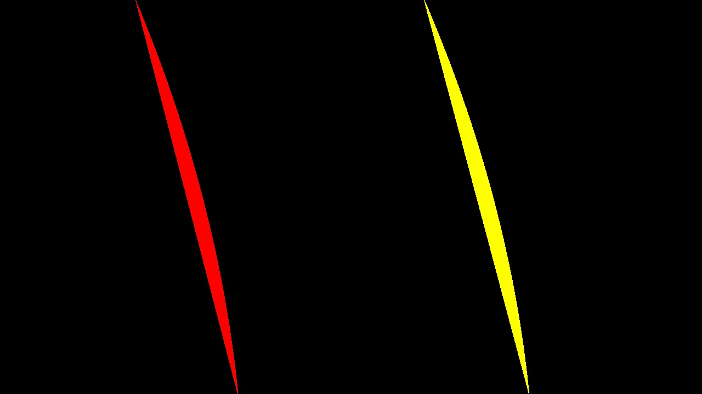
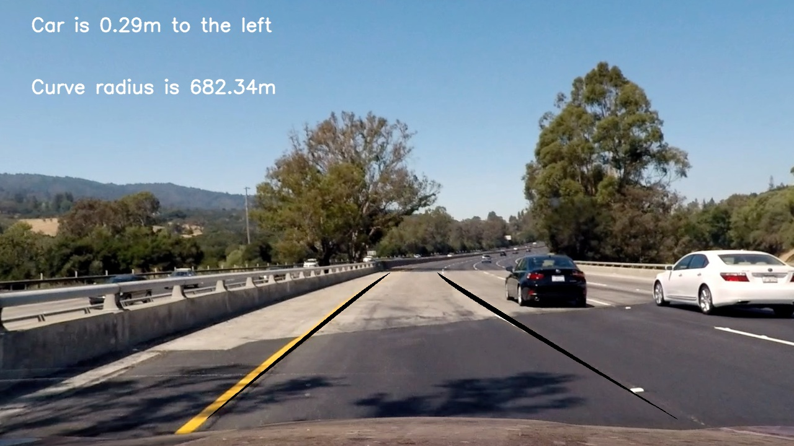

##Writeup Template
###You can use this file as a template for your writeup if you want to submit it as a markdown file, but feel free to use some other method and submit a pdf if you prefer.

---

**Advanced Lane Finding Project**

The goals / steps of this project are the following:

* Compute the camera calibration matrix and distortion coefficients given a set of chessboard images.
* Apply a distortion correction to raw images.
* Use color transforms, gradients, etc., to create a thresholded binary image.
* Apply a perspective transform to rectify binary image ("birds-eye view").
* Detect lane pixels and fit to find the lane boundary.
* Determine the curvature of the lane and vehicle position with respect to center.
* Warp the detected lane boundaries back onto the original image.
* Output visual display of the lane boundaries and numerical estimation of lane curvature and vehicle position.

[//]: # (Image References)

[image1]: ./examples/undistort_output.png "Undistorted"
[image2]: ./test_images/test1.jpg "Road Transformed"
[image3]: ./examples/binary_combo_example.jpg "Binary Example"
[image4]: ./examples/warped_straight_lines.jpg "Warp Example"
[image5]: ./examples/color_fit_lines.jpg "Fit Visual"
[image6]: ./examples/example_output.jpg "Output"
[video1]: ./project_video.mp4 "Video"

## [Rubric](https://review.udacity.com/#!/rubrics/571/view) Points
###Here I will consider the rubric points individually and describe how I addressed each point in my implementation.  

---
###Writeup / README

####1. Provide a Writeup / README that includes all the rubric points and how you addressed each one.  You can submit your writeup as markdown or pdf.  [Here](https://github.com/udacity/CarND-Advanced-Lane-Lines/blob/master/writeup_template.md) is a template writeup for this project you can use as a guide and a starting point.  

You're reading it!
###Camera Calibration

####1. Briefly state how you computed the camera matrix and distortion coefficients. Provide an example of a distortion corrected calibration image.

THe camera matrix and distortion coefficients were computed in camera_calibration.py.

I prepared object points (line 12-13) which represent the coordinates of the chessboard in the real world assuming it is a flat board with equdistant squares. I found the imagepoints in the chessboard images with cv2's findChessboardCorners (line 26).

Then I used the cv2.calibrateCamera function to computer the calibration and distortion coefficients of the camera and saved it for future use.

###Pipeline (single images)

####1. Provide an example of a distortion-corrected image.

In image_generation.py, I processed the images. I used cv2.undistort (line 82) using the coefficients that I calculated from the camera calibration. 

####2. Describe how (and identify where in your code) you used color transforms, gradients or other methods to create a thresholded binary image.  Provide an example of a binary image result.

I experimented with different color and gradient thresholds to create a binary image. Lines 26-75 define different thresholds and they are combined and applied to the image in lines 87-92 (image_generation.py).

####3. Describe how (and identify where in your code) you performed a perspective transform and provide an example of a transformed image.

I looked at the images to define a trapezoid that represented the lane lines and then defined the source points in lines 96-107 (image_generation.py) and then defined the corresponding destination points (114). I used cv2.getPerspectiveTransform to compute the perspective transform and cv2.warpPerspective to apply it to the image. I verified that it was working well by checking that the lines were parallel.

I verified that my perspective transform was working as expected by drawing the `src` and `dst` points onto a test image and its warped counterpart to verify that the lines appear parallel in the warped image.

####4. Describe how (and identify where in your code) you identified lane-line pixels and fit their positions with a polynomial?

I identified lane-line pixels by apply sliding window approach with a convolution in line_tracker.py to find the window centroids.

Then I collected the x values for centoids representing the left and right lanes and fit them to a polynomial in lines 168-176 (image_generation.py) using np.polyfit.

####5. Describe how (and identify where in your code) you calculated the radius of curvature of the lane and the position of the vehicle with respect to center.

In image_generation.py lines 125-126 I defined the meter to pixel ratio from looking at the images based on lane width 3.7m and lane length of 30m.

I calculated where the vehicle was with respect to the center in 201-210 by calculating where the center of the image is vs the line center and then scaling it by the pixel ratio.

I calculated the radius of lane curvature lines 212-219 by creating a scaled polynomial and then using the ratio formula discussed in the lesson. 

I appended these to the image using cv2.putText.

####6. Provide an example image of your result plotted back down onto the road such that the lane area is identified clearly.

I added the lane lines identified to the image in lines 182-197 (image_generation.py).

I generated a list of points for the polynomial (198-184) and used cv2.fillPoly to draw them. I unwarped the found lanes (194-195) and added them on top of the image (197).

---

###Pipeline (video)

####1. Provide a link to your final video output.  Your pipeline should perform reasonably well on the entire project video (wobbly lines are ok but no catastrophic failures that would cause the car to drive off the road!).

Here's a [link to my video result](./output_processed.mp4)

---

###Discussion

####1. Briefly discuss any problems / issues you faced in your implementation of this project.  Where will your pipeline likely fail?  What could you do to make it more robust?

Although it does pretty well, the pipeline may have trouble under extreme lighting conditions. Better color thresholding may help with this. Also when the lane trapezoid was made too large, the ends of the lanes were a bit messed up. Similarly if a car was in front of this car that might interfere with the lane detection. Steeply curved lanes may also warrant a different source definition. One way of improving the pipeline would be to dynamically define the source points based on image characteristics. If there was a very close rail next to the lane marker, the way we are detecting lanes with the sliding window/ convolution may detect this as a lane. It might be interesting to give more weight to lanes that are more likely to be correct given their distance from anther lane. 

